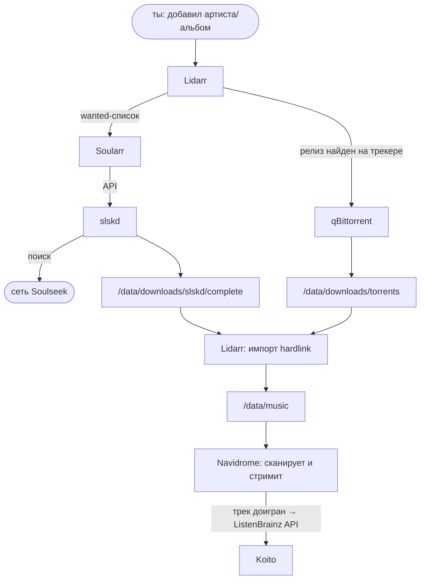

# pwnd-music

Selfhosted-стек для музыки на Docker Compose: стриминг, статистика прослушиваний,
автоматическое пополнение библиотеки из торрентов и Soulseek.

## Состав

| Сервис | Порт | Назначение |
|---|---|---|
| [Navidrome](https://www.navidrome.org/) | 4533 | Стриминг, веб-плеер, Subsonic API (мобильные клиенты: Symfonium, Tempo, play:Sub) |
| [Koito](https://koito.io/) | 4110 | Статистика прослушиваний (своя замена Last.fm) |
| [Lidarr](https://lidarr.audio/) | 8686 | Менеджер коллекции: следит за артистами, ищет релизы |
| [qBittorrent](https://www.qbittorrent.org/) | 8080 | Торрент-клиент для Lidarr |
| [slskd](https://github.com/slskd/slskd) | 5030 | Soulseek-демон + веб-UI для ручного поиска |
| [Soularr](https://github.com/mrusse/soularr) | 8265 | Мост: wanted-список Lidarr → автопоиск в Soulseek через slskd |

## Поток данных



## Структура на диске

```
${DATA_DIR}/                  # большой диск (по умолчанию /srv/media)
├── music/                    # библиотека
└── downloads/
    ├── torrents/             # загрузки qBittorrent
    └── slskd/
        ├── complete/         # завершённые загрузки slskd
        └── incomplete/

репозиторий/
├── docker-compose.yml
├── .env                      # секреты (НЕ в гите)
├── templates/soularr-config.ini
└── config/                   # runtime-данные контейнеров (НЕ в гите)
```

Единый корень `${DATA_DIR}` смонтирован в Lidarr как `/data` целиком: загрузки и
библиотека на одной файловой системе, поэтому импорт — мгновенный hardlink без
удвоения занятого места.

## Развёртывание на Proxmox

Два варианта. LXC легче по ресурсам, VM — полная изоляция и никаких
нюансов с Docker-in-LXC. Выбирай один.

### Вариант A: LXC (легковесный)

1. Создать LXC: Debian 12, unprivileged, 2 vCPU, 2–4 ГБ RAM, 16 ГБ rootfs.
   В опциях включить `keyctl=1, nesting=1`
   (вкладка Options → Features — нужно для Docker).
2. Пробросить диск с музыкой в LXC (на хосте Proxmox):
   ```
   pct set <CTID> -mp0 /tank/media,mp=/srv/media
   ```
3. Внутри LXC установить Docker:
   ```bash
   curl -fsSL https://get.docker.com | sh
   ```

Минусы: Docker внутри LXC официально Proxmox'ом не рекомендуется; после
крупных обновлений Proxmox изредка требуется чинить nesting-опции.

### Вариант B: VM (надёжный)

1. Создать VM: Debian 12 (netinst или cloud-init образ), 2 vCPU, 4 ГБ RAM,
   диск 20 ГБ под систему. Тип CPU — `host`, QEMU Guest Agent включить.
2. Отдать место под музыку — любой из способов:
   - **Отдельный виртуальный диск**: добавить второй диск VM нужного размера
     (Hardware → Add → Hard Disk), внутри VM отформатировать и смонтировать
     в `/srv/media`:
     ```bash
     mkfs.ext4 /dev/sdb && mkdir -p /srv/media
     echo '/dev/sdb /srv/media ext4 defaults 0 2' >> /etc/fstab && mount -a
     ```
   - **NFS с хоста/NAS**: расшарить каталог с музыкой и смонтировать в VM:
     ```bash
     apt install -y nfs-common
     echo '192.168.1.10:/tank/media /srv/media nfs defaults 0 0' >> /etc/fstab && mount -a
     ```
   - **Проброс физического диска целиком**:
     `qm set <VMID> -scsi1 /dev/disk/by-id/<диск>`.
3. Внутри VM установить Docker:
   ```bash
   curl -fsSL https://get.docker.com | sh
   ```

Минусы: чуть больше RAM/CPU overhead, чем у LXC.

### Запуск стека

```bash
git clone <repo-url> /opt/pwnd-music && cd /opt/pwnd-music

# 1. Окружение
cp .env.example .env
nano .env        # пути, таймзона, логин Soulseek, пароли, API-ключ slskd

# 2. Подхватить переменные из .env для следующих шагов
set -a; . ./.env; set +a

# 3. Конфиг Soularr
mkdir -p config/soularr
cp templates/soularr-config.ini config/soularr/config.ini
# LIDARR_API_KEY вставим после первого запуска (шаг ниже)

# 4. Каталоги конфигов. ВАЖНО: создать заранее — иначе docker создаст их
# под root, а Navidrome/slskd/Soularr бегут под PUID и не смогут писать.
mkdir -p config/{navidrome,koito,lidarr,qbittorrent,slskd,soularr}
sudo chown -R "$PUID:$PGID" config

# 5. Каталоги данных
sudo mkdir -p "$DATA_DIR"/music "$DATA_DIR"/downloads/torrents \
              "$DATA_DIR"/downloads/slskd/{complete,incomplete}
sudo chown -R "$PUID:$PGID" "$DATA_DIR"

# 6. Поехали
docker compose up -d
```

## Пост-настройка (один раз, ~10 минут)

### 1. Navidrome → Koito (скробблинг)

1. Открыть Koito `http://<host>:4110`, создать аккаунт.
2. Settings → **API Keys** → скопировать сгенерированный ключ.
3. Открыть Navidrome `http://<host>:4533`, создать админа.
4. Settings → Personal → включить **Scrobble to ListenBrainz** → вставить ключ → Save.

Endpoint уже прописан в compose (`ND_LISTENBRAINZ_BASEURL`), руками ничего больше не надо.

### 2. Lidarr: базовая настройка

1. Открыть `http://<host>:8686`, задать аутентификацию.
2. Settings → Media Management → Root Folder: **`/data/music`**.
3. Settings → General → скопировать **API Key** (нужен для Soularr).
4. Русский интерфейс: Settings → UI → Language → **Russian**.

### 3. Lidarr → qBittorrent

1. Логин qBittorrent — `admin`, пароль при первом старте временный, смотреть:
   `docker logs qbittorrent` → строка "temporary password".
2. Открыть `http://<host>:8080`, сменить пароль:
   Tools → Options → Web UI.
3. Там же Downloads → Default Save Path: **`/data/downloads/torrents`**,
   и Behavior → Language → **Русский**.
4. В Lidarr: Settings → Download Clients → `+` → qBittorrent:
   Host `qbittorrent`, Port `8080`, логин/пароль из шага 2, Category `music`.

### 4. Lidarr → Soularr → slskd

1. Вписать API-ключ Lidarr (шаг 2.3) в `config/soularr/config.ini`
   вместо `LIDARR_API_KEY`.
2. Вместо `SLSKD_API_KEY` — то же значение, что в `.env`.
3. `docker compose restart soularr`.
4. Проверка: `docker logs soularr` — не должно быть ошибок подключения.
   Веб-морда Soularr: `http://<host>:8265`.

slskd доступен на `http://<host>:5030` (логин из `.env`) — там же ручной поиск
по Soulseek, если хочется качнуть что-то мимо Lidarr.

## Проверка, что всё связано

1. В Lidarr добавить артиста с парой альбомов → Search.
2. Смотреть: qBittorrent тянет с трекеров, Soularr (`docker logs -f soularr`)
   ищет недостающее в Soulseek.
3. После импорта файлы появляются в `/srv/media/music`, Navidrome подхватывает
   при сканировании (каждый час, либо вручную: Activity → Quick Scan).
4. Послушать трек до конца → он появляется в Koito.

## Обслуживание

Версии образов зафиксированы в `docker-compose.yml`. Обновление — через
[Dependabot](https://docs.github.com/en/code-security/dependabot)
(конфиг `.github/dependabot.yml`): раз в неделю открывает PR с bump'ом
версий (minor/patch — сгруппированы, major — отдельно), ты ревьюишь и
мержишь. Включается само при пуше на GitHub. После мержа на сервере:

```bash
git pull && docker compose pull && docker compose up -d
docker compose logs -f <service>              # логи
```

Нюанс linuxserver-образов (lidarr, qbittorrent): они пересобираются на свежей
базе и под тем же тегом (CVE-фиксы базового слоя без смены версии приложения).
Dependabot такие ребилды не видит, поэтому раз в месяц стоит делать
`docker compose pull && docker compose up -d` даже без открытых PR.

**Бэкапить:** `.env`, `config/` (базы и настройки сервисов), сам `${DATA_DIR}/music`.
Репозиторий хранит всю декларативную конфигурацию; восстановление сервера =
clone + `.env` из бэкапа + `config/` из бэкапа + `docker compose up -d`.

## Безопасность

Стек рассчитан на доступ из локальной сети. Наружу (интернет) ничего не
пробрасывать как есть — для удалённого доступа использовать VPN до дома
(WireGuard/Tailscale) или reverse-proxy с аутентификацией. Торренты при
необходимости можно завернуть в VPN, добавив контейнер
[Gluetun](https://github.com/qdm12/gluetun) и `network_mode: service:gluetun`
у qBittorrent.
